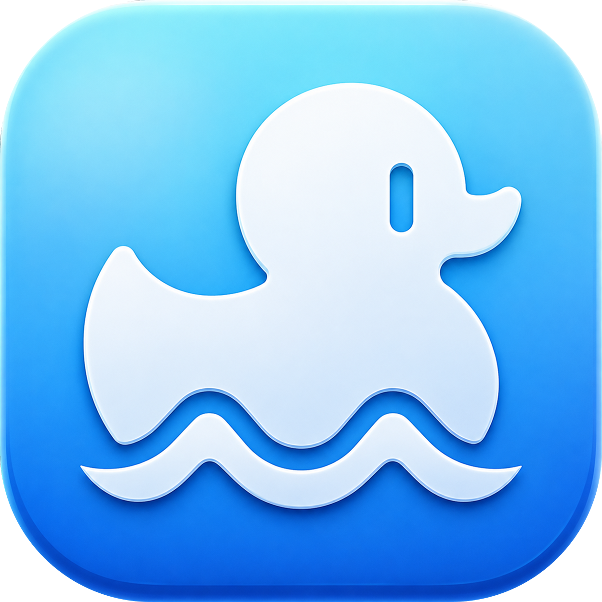

  

<h1 align="center">MenuDuck</h1>

A menu-bar utility for macOS 14+.

  English · <a href="README.ru.md">Русский</a> · <a href="README.es.md">Español</a> · <a href="README.zh-Hans.md">简体中文</a>

- Hide and reveal menu-bar icons.
- Use static wallpaper tools, mask the notch, or move the menu bar below the camera.
- Pro adds automation, profiles, Quick Reveal, and appearance controls.
- Optional plugins: **Stay Awake** keeps your Mac awake; **Network Speed** shows upload and download rates.

## Download

[Download the alpha from Releases](https://github.com/severiadev/menuduck/releases).

The alpha has no Developer ID signature or Apple notarization. Follow the [installation guide](docs/ALPHA_GUIDE.md) for first launch.

[Changelog](CHANGELOG.md) · [Feedback](SUPPORT.md) · [Privacy](PRIVACY.md)

This repository contains release files and documentation. The app's source code is private.
